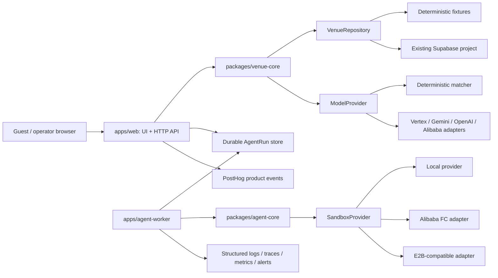

# Target architecture

## Decision

`vibetail-v2` is the long-term source of truth because the existing repository hides build/runtime behavior behind Lovable packages, mixes multiple retired product surfaces, and couples UI, provider calls, analytics, and persistence. The new repository keeps only the durable venue and agent capabilities behind explicit contracts.

The demo may temporarily reuse selected venue interaction/UI pieces to protect the August 22 schedule. That code is an isolated replaceable feature, not a foundation. Two parallel owners will replace the venue UI and venue flow; they integrate through `packages/contracts`, the versioned REST API, fixtures, and semantic states rather than by modifying Agent or provider packages.

## Runtime topology

For the demo, this may deploy as one web/API service and one worker. The same package boundaries allow later independent scaling without putting host-specific behavior into domain code.

## Stable contracts

`packages/contracts` owns runtime-validated version 1 schemas for:

- `VenueSummary`, `VenueMenu`, `VenueMenuItem`
- `VenuePreferences`, `VenueMatchRequest`, `VenueMatchResult`, `VenueError`
- `AgentRun`, `AgentRunEvent`, `AgentApprovalRequest`
- `VenueClient`
- canonical API route templates
- global directory/match results and minimal management inputs/results

The contract deliberately excludes legacy recipe/card/save/share fields. Model selection has the smaller `{ matchedItemId, whyThisMatch }` shape. Public menu availability is only `active | sold_out`; `hidden` is an internal storage state and cannot parse as public output.

## Venue boundary

Public entry remains `/m/:merchantSlug/:menuSlug`. The stable APIs are:

- `GET /v1/venues`
- `GET /v1/venues/:merchantSlug`
- `POST /v1/matches/global`
- `GET /v1/venues/:merchantSlug/menus/:menuSlug`
- `POST /v1/venues/:merchantSlug/menus/:menuSlug/match`

`VenueRepository` is the only database-facing port. `VenueService` loads the published menu, produces an active-item allowlist, asks a model provider for an ID, validates the current item again, and joins canonical database facts. UI code calls `VenueClient`; it never imports Supabase, a model SDK, or sandbox code.

Global and venue-specific matching are two scopes over that same pipeline. Global returns canonical merchant/menu/item facts plus the route to the selected venue experience. Inactive merchants, unpublished menus, sold-out items, hidden items, and provider IDs outside the allowlist fail closed.

Phase 2.5 adds a minimal `ManagementService`/`ManagementRepository` boundary for merchant/menu/item editing and publishing. Fixture mode uses public local demo tokens. The Supabase adapter hashes real private tokens and uses the service role only in the server dependency tree. This is an explicit compatibility step toward Supabase Auth plus merchant membership/RBAC, not the long-term authorization model.

Supabase remains the initial database but not a second product source of truth. Existing data is reused through a new repository adapter. Generated database types will be regenerated when credentials and the Phase 2 adapter are authorized. Old migrations and seeds are historical evidence, not replay instructions.

## Agent boundary

The API will create durable AgentRun records and append immutable events. The worker claims work, provisions a sandbox, executes, checkpoints, requests approval, hibernates, and later resumes from an approval event. Browser state, worker memory, or sandbox filesystem can never be the only workflow state.

Approval is versioned and idempotent. High-risk production deployment, database migration, DNS, secrets, destructive changes, external messages, and meaningful spend require approval. The demo creates previews/artifacts and does not perform unapproved production publication.

## Sandbox boundary

`packages/sandbox-runtime` defines lifecycle, capability reporting, execution, file IO, checkpoint/restore, logs, hibernate/resume, and terminate operations. Domain and worker code import only this interface. FC-specific code stays in `packages/provider-fc`; E2B-specific code stays in `packages/provider-e2b`.

For providers without native hibernation, the explicit fallback is checkpoint → terminate → recreate → restore → continue. That fallback may prove portability, but the FC hackathon path must show real FC hibernation, external wake, and continued workflow; polling is not accepted as evidence.

## Model boundary

Model adapters receive bounded preferences and canonical candidate metadata. They return only selection and explanation plus non-secret invocation metadata. Schemas, timeout, retry policy, trace ID, safe logging, and invalid-output failure are enforced at the adapter/service boundary. Image generation is not part of this architecture.

## Security and configuration

- `.env.example` documents no real values.
- Zod validates configuration at composition-root startup.
- Fixture/deterministic/local defaults allow credential-free builds and tests.
- Selecting Supabase, FC, E2B, or a remote model makes its endpoint/key fields mandatory.
- Public config contains only `APP_URL` and optional PostHog public configuration.
- Service role, model, and sandbox credentials are server/worker-only and are never injected wholesale into a sandbox.
- Structured logs use trace IDs and an explicit safe field set; authorization, cookies, prompts, and credentials are forbidden.

## Health and delivery

The web foundation contains testable health/readiness response builders. Phase 2 framework routing will expose `/health` and `/ready`; readiness will reflect required adapters rather than always returning success. CI performs frozen install, lint, strict typecheck, unit tests, build, and a forbidden-runtime-coupling scan.

## Demo architecture versus long-term architecture

| Concern | Demo path | Long-term path |
| --- | --- | --- |
| Venue data | deterministic fixture fallback; existing Supabase adapter in Phase 2 | repository adapter can evolve without UI changes |
| Venue UI | optional isolated legacy subset | parallel new UI replaces the entire legacy feature |
| Matching | deterministic provider fallback | selectable model adapters behind one contract |
| Sandbox | local tests plus real FC demo path | FC, E2B, or another provider by configuration/capability |
| Deployment | standard Node/container, Railway-compatible | portable service/worker topology |
| Workflow state | durable store/checkpoint design | queue/event-driven horizontally scalable workers |
| Observability | trace/log/timing evidence and SLS integration | provider-neutral telemetry sinks and production alerting |

The demo is a thin deployment of the long-term boundaries, not a separate code path. Only deterministic fallbacks may substitute external data/model availability; real command execution, hibernate, wake, resume, approval lifecycle, persistence, and trace evidence must not be simulated in the hackathon proof.
