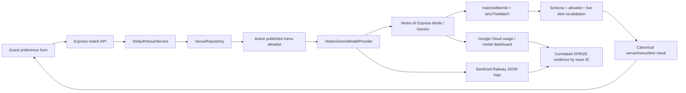

# Vibetail Tasting Agent: technical implementation plan

Status: **credential-free implementation complete and verified; Vertex canary and Railway deployment pending**

Branch/worktree: `codex/create-xprize-submission` / `/Users/hwang2/Desktop/projects/create-xprize-submission`

Target submission deadline: August 17, 2026 at 1:00 PM PDT

Required next checkpoint: provide the Vertex/Railway access inputs and explicitly approve the external deployment action

## 1. Objective

Implement a production Gemini-powered **Tasting Agent** using the repository's existing venue matching architecture, deploy the exact submission branch to Railway, and collect enough correlated evidence to show that Gemini is making live business decisions on Google Cloud.

The guest-facing contract remains simple:

1. the guest provides mood, flavors, occasion, alcohol preference, exclusions, optional free text, and locale;
2. the server loads only eligible, currently available menu items;
3. Gemini selects one item ID and writes a concise explanation;
4. the server re-reads and validates the selected item;
5. Vibetail returns canonical venue/menu/item facts plus a trace ID;
6. sanitized provider metadata makes the decision auditable without exposing customer text, prompts, or secrets.

The plan deliberately minimizes surface area. It adds one provider and the evidence plumbing needed for the XPRIZE entry; it does not create a new agent framework.

## 2. Product definition

### What the agent is

The Tasting Agent is a bounded decision agent that:

- accepts a human goal and constraints;
- observes live, venue-owned menu candidates;
- uses Gemini to choose among those candidates;
- explains its selection in the guest's locale;
- is prevented from inventing menu facts;
- yields a traceable production decision.

### Human versus AI responsibilities

| Actor | Responsibility |
| --- | --- |
| Venue staff | Own menu names, descriptions, ingredients, prices, allergens, availability, publication status, and final business policy. |
| Guest | Supplies mood and taste preferences and decides whether to act on the recommendation. |
| Tasting Agent/Gemini | Selects one eligible item ID and explains why it fits the request. |
| Vibetail server | Builds the allowlist, validates all inputs/outputs, checks live availability again, joins canonical facts, applies timeout/error policy, and records safe metadata. |

### Non-goals for this submission

- no FC Sandbox, E2B, code execution, hibernation, wake, resume, or approval state machine;
- no generalized tool-calling loop;
- no browser-side Gemini SDK or API key;
- no production database migration;
- no DNS change;
- no image generation;
- no redesign of the current matching UI;
- no automatic fallback to a non-Gemini provider in the judged production flow.

If Vertex fails, the production request must return the existing retryable provider error. A silent deterministic/OpenRouter fallback would undermine the proof that the judged decision came from Gemini.

## 3. Existing baseline

The implementation should extend, not replace, these working boundaries:

| Existing area | Current responsibility | Planned use |
| --- | --- | --- |
| `packages/model-providers/src/index.ts` | Provider-neutral request/result contracts | Add optional Gemini usage/response metadata without breaking existing providers. |
| `packages/model-providers/src/venue-prompt.ts` | Bilingual matching instruction | Reuse as the Gemini system instruction. |
| `packages/model-providers/src/drink-info-prompt.ts` | Venue authoring-assist instruction | Reuse so the Vertex provider satisfies the current `ModelProvider & DrinkInfoProvider` composition type. |
| `packages/venue-core/src/service.ts` | Builds candidate allowlist, invokes provider, revalidates selected ID, returns canonical facts | Keep behavior unchanged except optional audit event emission if needed. |
| `apps/web/src/server/dependencies.ts` | Selects repository/model implementations | Add the `vertex` provider branch and inject the telemetry sink. |
| `apps/web/src/env.ts` | Validates server/public configuration | Add explicit Vertex variables and fail-fast selection rules. |
| `apps/web/src/features/matching/components/MatchFlow.tsx` | Preference/loading/error/result UX | Preserve the API contract; only adjust copy/badging if necessary for the demo. |
| `packages/observability/src/index.ts` | Vendor-neutral telemetry types and forbidden fields | Add a JSON console sink or narrowly scoped Tasting Agent event helper. |
| `railway.toml` | Build/start/health/restart behavior | Retain current build and health gate; use a new preview/staging deployment. |
| `scripts/check-client-bundle.mjs` | Detects server-secret leakage | Add the Vertex key name and, in CI, the actual secret value when safely available. |

Current public APIs remain unchanged:

- `POST /v1/matches/global`
- `POST /v1/venues/:merchantSlug/menus/:menuSlug/match`
- `GET /v1/venues/:merchantSlug/menus/:menuSlug`
- `/match`
- `/m/:merchantSlug/:menuSlug`

No client migration is required.

## 4. Target architecture



Only `packages/model-providers` imports `@google/genai`. UI and domain code remain provider-neutral.

## 5. Authentication and provider choice

### Selected path

Use **Vertex AI Express Mode** through `@google/genai`:

```ts
new GoogleGenAI({
  vertexai: true,
  apiKey: vertexApiKey,
});
```

Reasons:

- it is an official Vertex AI/Google Cloud path;
- it uses a single API key suitable for a Railway runtime;
- it avoids writing service-account JSON to ephemeral storage;
- the key remains a server-only Railway variable;
- it supports the Google Gen AI SDK, Gemini models, structured response schemas, request timeout configuration, response IDs/model versions, and token usage metadata where returned.

Official references:

- <https://docs.cloud.google.com/vertex-ai/generative-ai/docs/samples/googlegenaisdk-vertexai-express-mode>
- <https://docs.cloud.google.com/vertex-ai/generative-ai/docs/start/quickstart>
- <https://googleapis.github.io/js-genai/release_docs/interfaces/types.GenerateContentConfig.html>
- <https://googleapis.github.io/js-genai/release_docs/classes/types.GenerateContentResponse.html>

### Required configuration

Add these variables:

| Variable | Secret | Required in production | Purpose |
| --- | --- | --- | --- |
| `MODEL_PROVIDER=vertex` | No | Yes | Selects the adapter. |
| `MODEL_NAME=gemini-3.5-flash` | No | Yes | Submission model verified in the selected Google Cloud project; remains configurable. |
| `VERTEX_API_KEY` | **Yes** | Yes | Vertex AI Express Mode credential. |
| `GOOGLE_CLOUD_PROJECT` | No | Yes for evidence | Identifies the Google Cloud project used for billing/screenshots. The Express SDK client does not need it for key auth, but the deployment/evidence manifest does. |
| `GOOGLE_CLOUD_LOCATION=global` | No | Yes for provenance | Records the configured Vertex region/location. |

Do not reuse `MODEL_API_KEY`; an explicit `VERTEX_API_KEY` makes secret rotation, bundle scanning, incident handling, and provider ownership unambiguous.

Keep existing `OPENROUTER_API_KEY` configured only in the old staging environment if rollback needs it. Do not inject it into the new preview service unless the preview is explicitly designed to support manual provider rollback.

### Credential preparation before coding

The user/operations owner must:

1. create or select the Google Cloud project for the XPRIZE entry;
2. enable Vertex AI/Express Mode and billing;
3. create a dedicated key for Vibetail staging/submission;
4. restrict the key as tightly as the current Vertex console permits;
5. record the project ID and billing account used for evidence;
6. store the key in a password manager until it is entered directly into Railway;
7. never paste the key into chat, source, `.env.example`, screenshots, logs, or Devpost text.

## 6. Provider implementation design

### New file

Create `packages/model-providers/src/vertex-gemini.ts` containing:

- `VertexGeminiClient`, a narrow injectable client interface for deterministic tests;
- `VertexGeminiModelProviderOptions`;
- `VertexGeminiModelProvider implements ModelProvider, DrinkInfoProvider`;
- private helpers for request construction, JSON extraction, metadata normalization, and safe provider error translation.

Export the provider from `packages/model-providers/src/index.ts`.

### SDK dependency

Add `@google/genai` only to `packages/model-providers/package.json`, then update `pnpm-lock.yaml` with the pinned workspace package manager.

Before merging, inspect the resolved dependency tree and license. Run the repository's supply-chain/lockfile verification during install and CI.

### Matching request

Call `client.models.generateContent` with:

- `model: options.model`;
- `systemInstruction: venueMatchSystemPrompt(request.locale)`;
- user content containing only `preferences` and `allowedItems`;
- `responseMimeType: "application/json"`;
- a strict response schema equivalent to `modelMatchSelectionSchema`;
- `candidateCount: 1`;
- `temperature` kept low for repeatability;
- bounded `maxOutputTokens` sufficient for a short explanation;
- `httpOptions.timeout: request.timeoutMs`;
- no tools, web access, files, image input, or automatic function calling.

The JSON response schema must require exactly:

```json
{
  "matchedItemId": "uuid from the supplied allowlist",
  "whyThisMatch": "short guest-facing explanation"
}
```

Set `additionalProperties: false`. The response must still pass `modelMatchSelectionSchema.strict()` after JSON parsing; the model schema is not trusted as the only validator.

### Drink-info request

Because `createModelProvider` currently returns `ModelProvider & DrinkInfoProvider`, implement `suggestDrinkInfo` through the same Vertex client using `drinkInfoSystemPrompt` and `drinkInfoSuggestionSchema`.

This is authoring assistance only. Venue staff can edit the output before save, and no generated fact bypasses the canonical venue record.

Menu photo/url extraction and drink-photo processing remain on their current paths; they are not part of the Tasting Agent submission gate.

### Output and failure behavior

Success requires all of the following:

1. the SDK returns a non-empty text response;
2. JSON parsing succeeds;
3. strict Zod parsing succeeds;
4. `matchedItemId` occurs in the exact request allowlist;
5. venue-core re-reads the item from the repository;
6. the item is still in the same menu and is still active;
7. canonical venue/menu/item fields come from the repository.

On timeout, provider refusal, safety block, empty response, malformed JSON, invalid schema, or HTTP failure:

- emit a sanitized failure event;
- throw a provider error without response bodies or secrets;
- allow the current service layer to return `MATCH_PROVIDER_UNAVAILABLE`, HTTP 503, `retryable: true`, and the trace ID;
- do not fall back silently.

Do not log Gemini thought content, full prompts, raw preferences, API keys, HTTP headers, or full provider error bodies.

### Retry policy

For the deadline build:

- one primary request;
- at most one SDK/network retry for transient 429/5xx/connectivity failures if supported by the configured SDK retry options;
- no retry for schema rejection, safety refusal, invalid selected ID, or other semantic failures;
- keep the entire request inside the current 20-second service budget;
- record `attempt` in provider metadata.

This prevents duplicate spend and keeps the guest loading state bounded.

## 7. Contract and telemetry changes

### Model metadata

Extend `ModelInvocationMetadata` with optional fields so existing providers remain source-compatible:

```ts
interface ModelInvocationMetadata {
  provider: string;
  model: string;
  attempt: number;
  durationMs: number;
  promptTokenCount?: number;
  outputTokenCount?: number;
  totalTokenCount?: number;
  responseId?: string;
  modelVersion?: string;
  finishReason?: string;
}
```

Map Vertex `usageMetadata`, `responseId`, and `modelVersion` when returned. Missing metadata is allowed and must not fail a valid match.

### Structured events

Implement a JSON-console telemetry sink in `packages/observability` or a narrowly scoped helper in the web composition root. Planned events:

| Event | Level | Safe fields |
| --- | --- | --- |
| `tasting_agent_request_started` | info | trace ID, provider, model, candidate count, locale, match scope (`global`/`venue`) |
| `tasting_agent_request_completed` | info | trace ID, provider, model, selected item ID, duration, attempt, token counts, response ID/model version |
| `tasting_agent_request_failed` | warn/error | trace ID, provider, model, duration, attempt, normalized error code |
| `tasting_agent_selection_rejected` | warn | trace ID, provider, reason category (`unknown_id`, `stale_item`, `cross_menu`, `inactive`) |

Never log mood/free-text contents, ingredients, customer identity, private venue token, authorization, cookies, system instructions, raw model response, or secrets.

If adding a domain callback to record post-provider revalidation, define a small provider-neutral audit interface and supply a no-op default so venue-core tests and other consumers remain compatible. Do not import Railway, Google, or a logging SDK into venue-core.

### Evidence correlation

The response already returns `traceId`. For every recorded demo run:

- capture the user-visible result and trace ID;
- locate the matching Railway JSON event by trace ID;
- capture the corresponding Vertex usage/dashboard time window;
- record deployed commit SHA, Railway deployment ID, UTC timestamp, provider, and model in the evidence index.

## 8. Environment and composition changes

### `apps/web/src/env.ts`

- retain `vertex` in `MODEL_PROVIDER`;
- add `VERTEX_API_KEY`, `GOOGLE_CLOUD_PROJECT`, and `GOOGLE_CLOUD_LOCATION` to the server schema;
- when `MODEL_PROVIDER=vertex`, require `VERTEX_API_KEY`, `MODEL_NAME`, `GOOGLE_CLOUD_PROJECT`, and `GOOGLE_CLOUD_LOCATION`;
- do not place any of those variables in `publicEnvSchema` except none are needed by the browser;
- keep deterministic local mode credential-free;
- retain OpenRouter/OpenAI validation unchanged.

### `apps/web/src/server/dependencies.ts`

Add the `vertex` case to `createModelProvider`:

- validate that parsed env already contains the required fields;
- construct `VertexGeminiModelProvider` once at process startup;
- reuse the same client across requests;
- pass the telemetry sink;
- keep all other provider cases available for local tests and rollback.

### Readiness behavior

Do not make `/ready` call Gemini on every health probe; that would add latency and spend. Readiness should confirm startup configuration and repository access. The deployment smoke test performs the real Gemini canary after the service becomes active.

Optionally expose the selected provider/model in `/ready` only if it does not leak secrets and does not break the existing response contract. The startup log already records the provider; recording the non-secret model name is acceptable.

## 9. Security plan

- Add `VERTEX_API_KEY` to `scripts/check-client-bundle.mjs`.
- Add it to the forbidden log-field policy where applicable.
- Ensure no secret is prefixed with `VITE_`; Railway exposes all service variables to the build process, and Vite would bundle variables using its public prefix.
- Store the real key only as a **sealed Railway service variable**.
- Do not pass server variables into frontend runtime config.
- Do not add the key to fixture data, snapshots, test output, source maps, screenshots, or error messages.
- Use placeholder values such as `test-vertex-key` in unit tests.
- Run `pnpm audit:client` and inspect the built JavaScript for the variable name and known test/real secret values.
- Search source and git diff for common key fragments before commit.
- If a key is exposed, stop deployment, rotate it in Google Cloud, replace the Railway sealed variable, and re-run the audit before continuing.

## 10. Test plan

### Provider unit tests

Create `packages/model-providers/src/vertex-gemini.test.ts` with an injected fake `VertexGeminiClient`.

Required cases:

1. sends the system instruction, preferences, and exact allowlist;
2. sets JSON MIME type and strict response schema;
3. uses configured model and request timeout;
4. parses a valid match and maps usage/response metadata;
5. supports English and Chinese locale prompts;
6. rejects an empty response;
7. rejects malformed JSON;
8. rejects extra/invalid fields;
9. rejects invalid UUID/too-short explanation according to the shared schema;
10. converts timeout/429/5xx to sanitized provider failures;
11. never includes the API key in an error;
12. implements drink-info suggestions through the same strict path.

### Environment tests

Extend `apps/web/src/env.test.ts`:

- vertex selection fails without each required value;
- a complete vertex configuration parses;
- Vertex secrets do not appear in public config;
- deterministic defaults remain unchanged;
- OpenRouter/OpenAI validation remains unchanged.

### Composition tests

Test `createWebDependencies` with a client/provider injection seam or factory so no real network call is made. Confirm `MODEL_PROVIDER=vertex` selects the Vertex adapter.

### Domain regression tests

Existing tests must continue to prove:

- only active items reach the provider;
- unknown/cross-menu/hidden/sold-out/stale selections fail closed;
- canonical facts come from the repository;
- global and venue-specific match paths work;
- provider failures return structured retryable errors;
- feedback/match recording remains best-effort and does not corrupt a successful recommendation.

Add a metadata/audit assertion only if telemetry crosses the service boundary.

### Integration and build tests

Run in this order:

```sh
pnpm install --frozen-lockfile
pnpm lint
pnpm typecheck
pnpm test:unit
pnpm test:integration
pnpm build
pnpm audit:forbidden
pnpm audit:client
pnpm run ci
```

The final `pnpm run ci` is the release gate on the exact commit.

### Credentialed canary test

Run one explicit test outside normal CI using the real Vertex key:

- use a known fixture menu and preferences;
- assert HTTP 200;
- assert result item ID belongs to the supplied active allowlist;
- assert provider/model/duration/usage metadata appears in safe logs;
- save no raw credential or full preference data;
- record time, trace ID, model, and commit SHA in the private evidence log.

Live-provider tests must not run on every unit-test invocation.

## 11. Documentation changes included with implementation

Update:

- `.env.example` with empty `VERTEX_API_KEY`, project/location, and model examples;
- `README.md` with the Tasting Agent flow, local deterministic mode, and Vertex production mode;
- `docs/architecture/current-system-status.md` only after successful live verification;
- `docs/architecture/provider-boundaries.md` to mark Vertex as implemented and tested;
- `docs/operations/deployment.md` with Railway Vertex variables, canary, evidence, and rollback;
- `docs/demo/xprize/testing-instructions.md`;
- `docs/demo/xprize/evidence-index.md`;
- `docs/demo/xprize/release-checklist.md`;
- `docs/demo/xprize/video-script.md` after the actual UI/trace is known.

Do not claim Gemini/Vertex is live until the credentialed canary and public Railway match both succeed.

## 12. Git and commit sequence

Work only in `/Users/hwang2/Desktop/projects/create-xprize-submission` on `codex/create-xprize-submission`.

Recommended small commits:

1. `docs: define xprize tasting agent implementation plan`
2. `feat: add vertex gemini tasting provider`
3. `feat: wire tasting agent telemetry and configuration`
4. `test: cover vertex tasting agent and fail-closed behavior`
5. `docs: add xprize railway runbook and evidence checklist`

Before each commit:

- inspect `git diff --check`;
- confirm no unrelated user work is included;
- confirm no secret or customer evidence is staged.

Do not push or open a PR until the local implementation and full CI pass. Do not deploy until the user explicitly approves the Railway action.

## 13. Railway deployment plan

Official Railway references:

- variables and sealed variables: <https://docs.railway.com/variables>
- healthchecks: <https://docs.railway.com/deployments/healthchecks>
- deployments and rollback: <https://docs.railway.com/deployments/deployment-actions>
- frontend secret boundary: <https://docs.railway.com/guides/frontend-environment-variables>

### Deployment topology

Preferred: create a separate `xprize-submission` Railway environment/service from the dedicated branch so the currently healthy staging deployment remains an immediate fallback.

Use:

- source branch: `codex/create-xprize-submission` or the merged/pinned submission commit;
- build command from `railway.toml`: `pnpm build`;
- start command: `node apps/web/dist/server/index.js`;
- healthcheck: `/health`, timeout 300 seconds;
- generated Railway domain; no custom DNS change;
- one web/API service; no worker required;
- existing Supabase public-read variables if approved for this preview;
- `SANDBOX_PROVIDER=local` because sandbox behavior is not used by the Tasting Agent.

### Railway variables

Non-secret variables:

```text
NODE_ENV=production
APP_URL=https://<xprize-service>.up.railway.app
VENUE_REPOSITORY=supabase
MODEL_PROVIDER=vertex
MODEL_NAME=gemini-3.5-flash
GOOGLE_CLOUD_PROJECT=<project-id>
GOOGLE_CLOUD_LOCATION=global
SANDBOX_PROVIDER=local
LOG_LEVEL=info
```

Secrets, entered directly and sealed in the service:

```text
VERTEX_API_KEY=<sealed>
SUPABASE_URL=<existing approved value>
SUPABASE_PUBLISHABLE_KEY=<existing approved value>
```

`SUPABASE_URL` is not normally secret, but keep environment ownership consistent. Do not add a service-role key unless venue-management persistence is separately approved and required; guest matching needs only the public read path.

### Pre-deployment checklist

- [ ] Exact branch/commit identified.
- [ ] Local `pnpm run ci` passes.
- [ ] Key/bundle scans pass.
- [ ] Vertex canary succeeds outside Railway.
- [ ] Google Cloud billing and usage views are accessible to the evidence owner.
- [ ] Railway service variables are reviewed before applying staged changes.
- [ ] Existing staging deployment ID and rollback path are recorded.
- [ ] No production migration or DNS action is included.
- [ ] Deployment approval received from the user.

### Deployment sequence

1. Push the verified branch/commit using the dedicated `daaabing` GitHub account.
2. Create or select the Railway XPRIZE preview environment/service.
3. Point it at the exact source branch/commit.
4. Add non-secret variables.
5. Add and seal `VERTEX_API_KEY` and existing approved Supabase values.
6. Review staged Railway changes.
7. Deploy.
8. Wait for build success and `/health` 200; Railway will not activate the new deployment until the healthcheck succeeds.
9. Check `/ready` 200 and confirm Supabase menu count.
10. Execute the signed-out smoke/canary suite below.
11. If all tests pass, record the public URL and deployment metadata.
12. Keep the prior healthy deployment available until the Devpost submission is confirmed.

### Public smoke suite

Use the generated public domain while signed out:

```text
GET  /health
GET  /ready
GET  /
GET  /venues
GET  /match
GET  /m/double-chicken-please/main
GET  /v1/venues
GET  /v1/venues/double-chicken-please/menus/main
POST /v1/matches/global
POST /v1/venues/double-chicken-please/menus/main/match
```

Verify:

- health/readiness return 200;
- current `/v1/venues` exists, proving this is not the stale `/v1/restaurants` deployment;
- both match endpoints return 200 with an active item and trace ID;
- the explanation is non-template Gemini output;
- the trace ID appears once in sanitized Railway logs;
- the logged provider/model are `vertex` and the configured Gemini model;
- the selected item is present in the current menu response;
- mobile and desktop UIs show loading, result, retry, and edit states;
- browser console/network contain no secret;
- Google Cloud usage changes in the corresponding time window.

Perform at least three recorded matches: one global, one venue-specific English, and one venue-specific Chinese or a materially different preference case.

### Rollback plan

Rollback triggers:

- build or healthcheck failure;
- `/ready` failure;
- Vertex authentication/model error;
- match error rate during smoke tests;
- invalid/non-allowlisted selection;
- secret visible in client/logs;
- current API routes missing;
- unacceptable latency that breaks the demo.

Actions:

1. stop the public smoke run;
2. if secret exposure is suspected, rotate the Vertex key before any other action;
3. use Railway's deployment rollback to restore the previously successful image and its variables, or switch traffic back to the untouched prior staging service;
4. verify `/health`, `/ready`, and the previous matching path;
5. keep the failed XPRIZE service private/offline until fixed;
6. document the normalized failure cause without copying secrets or raw provider payloads;
7. fix locally, run full CI and canary again, then request deployment approval again if the scope changed materially.

Railway rollback restores the previous image and custom variables, but sealed variables are not copied into duplicated/PR environments. Therefore the XPRIZE service must receive its sealed Vertex key explicitly.

## 14. Production evidence plan

Create a private evidence directory outside git for raw screenshots and billing/customer documents. Commit only redacted indices and non-sensitive test instructions.

For each final demo match, record:

| Field | Source |
| --- | --- |
| UTC/PDT timestamp | operator log |
| public URL | Railway |
| git commit SHA | Git/Railway deployment |
| Railway deployment ID | Railway variables/deployment page |
| trace ID | API/UI result |
| provider/model | safe Railway JSON event |
| duration/attempt/token counts | safe Railway JSON event |
| matched item ID | API result/log |
| live menu membership/availability | menu API result |
| response/model usage window | Vertex AI dashboard |
| billing/cost evidence | Google Cloud billing report |

Required screenshots/exports:

- public guest input and result;
- result/API trace ID;
- sanitized Railway log event;
- Vertex/Gemini usage or observability dashboard;
- Google Cloud cost/usage view and available statements;
- Railway deployment showing the submission commit and active status;
- final `pnpm run ci` result;
- no-secret bundle/forbidden-runtime scan result.

Redact API keys, billing account identifiers where unnecessary, private customer data, authorization headers, tokens, and raw free-text preferences.

## 15. Implementation order and time budget

The order is dependency-driven:

1. **Access readiness (30–60 min, operations):** create Vertex key/project, confirm Railway preview path, open Devpost draft.
2. **Provider and schemas (2–3 h):** SDK dependency, client seam, matching/drink-info methods, strict parsing, metadata.
3. **Env/composition/security (1–2 h):** config validation, dependency selection, telemetry, bundle scanning.
4. **Tests and regression (2–3 h):** provider/env/composition/domain tests and full CI.
5. **Credentialed canary (30–60 min):** one real Vertex call and evidence correlation.
6. **Docs/release prep (1–2 h):** runbook, status, evidence index, testing instructions.
7. **Railway deployment (1–2 h after approval):** variables, deploy, smoke tests, rollback readiness.
8. **Evidence/video capture (2–3 h, parallel with business evidence):** three traces, screenshots, recording inputs.

Expected focused engineering effort: approximately 8–12 hours plus business evidence and video work. Cut optional UI copy and optional domain audit callbacks before cutting provider correctness, security, tests, deployment verification, or evidence.

## 16. External release prerequisites

The local adapter, wiring, tests, security checks, production build, and deterministic smoke test are complete. A live canary or Railway deployment must not start until these questions have concrete answers:

- [x] The user approved implementation of the Vertex AI Express Mode path.
- [ ] A dedicated Google Cloud project and billing account are ready.
- [ ] A Vertex Express Mode key can be created and will be entered directly into Railway by an authorized owner.
- [x] The submission Gemini model is available in project `vibetail`: `gemini-3.5-flash` in `global`.
- [ ] The Railway target is a separate XPRIZE preview/staging service or environment.
- [ ] The current Supabase public-read values may be used in that target.
- [ ] The final judged URL is intended to remain available through September 15.
- [ ] No production migration, service-role key, or DNS change is required.
- [ ] The business evidence owner is gathering customer/revenue/GCP documents in parallel.

Until the Vertex key and Railway approval are available, live verification and submission readiness remain blocked even though the credential-free implementation is complete.

## 17. Definition of Done

The Tasting Agent implementation is complete only when:

- [x] `VertexGeminiModelProvider` is implemented behind the existing provider interface.
- [x] Gemini output is constrained to strict `matchedItemId + whyThisMatch` parsing.
- [x] server-side allowlist and live-item revalidation remain intact.
- [x] canonical facts still come only from the venue repository.
- [x] Vertex configuration fails fast and remains server-only.
- [x] telemetry code and tests cover safe provider/model/trace/latency/usage evidence.
- [x] malformed, stale, hidden, sold-out, cross-menu, refused, and timed-out responses fail closed through provider/domain tests.
- [x] deterministic local tests remain credential-free.
- [x] full repository CI passes in the worktree; the exact submission commit is still pending.
- [x] bundle/runtime scans contain no Vertex secret or Lovable dependency, including a build with a fake secret value.
- [ ] a credentialed Vertex canary succeeds.
- [ ] a current Railway preview deployment passes health, readiness, API, UI, and live-Gemini smoke tests.
- [ ] at least three production traces are correlated with Vertex usage evidence.
- [x] README, status, deployment, testing, evidence, and release documentation match the current pre-deployment state.
- [ ] rollback is documented and the previous healthy deployment remains recoverable.
- [ ] no production migration or DNS change occurred.

Only after every applicable item is verified should the Devpost narrative and video call the Tasting Agent live in production.
